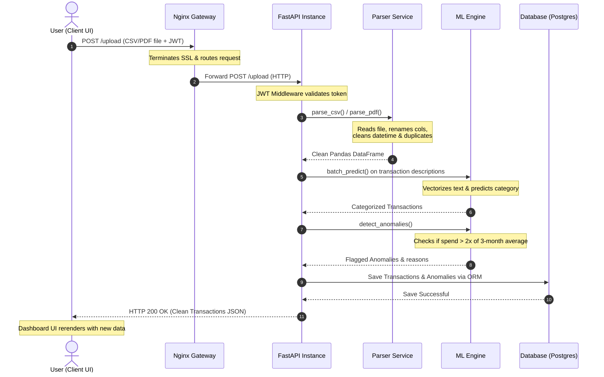
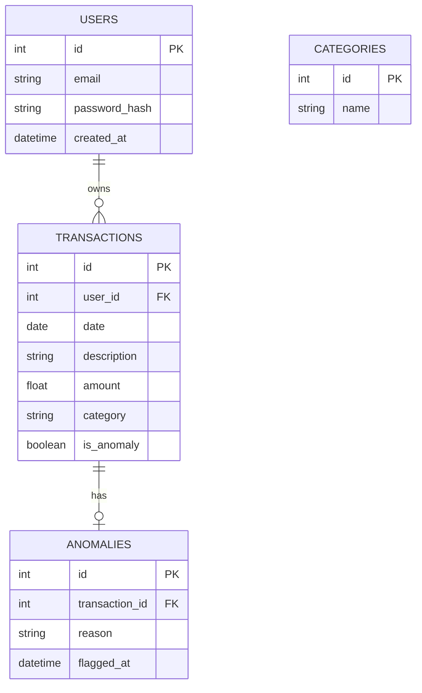

# SpendLens Refined System Design & Architecture

This document presents a refined system architecture, database schema, and core processing flow for **SpendLens**, based on the documentation provided by the team members.

## Original Diagrams
For reference, here are the original visual assets extracted from the documents:
- **System Design Overview**: 
- **Dashboard Mockup**: 

---

## 1. Refined System Architecture
The system employs a modern, three-tier architecture that decouples the frontend client, backend server, and persistence layers. This separation ensures scalability, ease of maintenance, and high performance.

```mermaid
graph TD
    %% Styling
    classDef client fill:#3b82f6,stroke:#1d4ed8,stroke-width:2px,color:#fff;
    classDef gateway fill:#10b981,stroke:#047857,stroke-width:2px,color:#fff;
    classDef backend fill:#8b5cf6,stroke:#6d28d9,stroke-width:2px,color:#fff;
    classDef logic fill:#f59e0b,stroke:#d97706,stroke-width:2px,color:#fff;
    classDef db fill:#ec4899,stroke:#be185d,stroke-width:2px,color:#fff;

    subgraph ClientLayer["Client Layer (Vercel CDN / React)"]
        UI["React Web App (5 Pages)"]:::client
        Axios["Axios Client (with JWT Auth)"]:::client
    end

    subgraph Infrastructure["Gateway & Load Balancing (Render.com)"]
        Nginx["Nginx Load Balancer<br>(SSL Termination & Round-Robin)"]:::gateway
    end

    subgraph APILayer["API Instance Cluster (FastAPI / Uvicorn)"]
        F1["FastAPI Instance 1<br>(Uvicorn Worker)"]:::backend
        F2["FastAPI Instance 2<br>(Uvicorn Worker)"]:::backend
        F3["FastAPI Instance 3<br>(Uvicorn Worker)"]:::backend
    end

    subgraph AppLogic["Service & ML Layer"]
        subgraph FastAPIInternal["FastAPI Application"]
            JWT["JWT Middleware"]:::backend
            CORS["CORS Middleware"]:::backend
            Routers["Routers<br>(Auth, Upload, Tx, Analytics, Report)"]:::backend
        end
        
        subgraph Services["Business Logic Services"]
            Parser["Vaidehi's Parser<br>(CSV / PDF Parser)"]:::logic
            Analytics["Analytics Engine<br>(Pandas Monthly Summary)"]:::logic
            PDFGen["PDF Report Generator<br>(fpdf2)"]:::logic
        end
        
        subgraph MLEngine["ML Engine (In-Memory)"]
            Vec["TF-IDF Vectorizer<br>(vectorizer.pkl)"]:::logic
            Clf["Classifier Model<br>(model.pkl)"]:::logic
            Anomaly["Anomaly Detector<br>(detect_anomalies)"]:::logic
        end
    end

    subgraph DataLayer["Persistence Layer"]
        ORM["SQLAlchemy ORM"]:::db
        SQLite["SQLite DB<br>(Local Dev)"]:::db
        Postgres["PostgreSQL DB<br>(Production)"]:::db
    end

    %% Connections
    UI --> Axios
    Axios -->|HTTPS + JWT| Nginx
    Nginx -->|HTTP (Round-Robin)| F1
    Nginx -->|HTTP (Round-Robin)| F2
    Nginx -->|HTTP (Round-Robin)| F3

    F1 --> JWT
    F2 --> JWT
    F3 --> JWT
    JWT --> CORS
    CORS --> Routers

    Routers -->|Upload API| Parser
    Routers -->|Analytics API| Analytics
    Routers -->|Report API| PDFGen
    
    Parser -->|Clean DataFrame| Vec
    Vec -->|Features| Clf
    Clf -->|Predicted Categories| Anomaly
    
    Routers --> ORM
    Analytics --> ORM
    PDFGen --> ORM
    
    ORM -->|DATABASE_URL| SQLite
    ORM -->|DATABASE_URL| Postgres
```

### Refined Component Diagram


### Architectural Highlights:
* **Client Layer**: React.js hosted on Vercel utilizing the Vercel CDN for static assets. Communication is handled via Axios, securing endpoints using a **JWT** inside the `Authorization` header.
* **API Load Balancer (Gateway)**: Nginx is positioned in front of the FastAPI instances to handle round-robin routing and SSL/TLS termination, keeping the internal FastAPI communication fast and lightweight over HTTP.
* **FastAPI Cluster**: Running three independent `uvicorn` workers. Each worker processes JWT authentication and CORS configurations middleware-level before routing requests to individual controllers.
* **Service Layer**: Decoupled Python modules that containerize Vaidehi's parser engine (using `pandas` and `pdfplumber`), custom Pandas analytics calculators, and the `fpdf2` PDF report compiler.
* **ML Engine**: `model.pkl` and `vectorizer.pkl` are loaded once into memory during the application lifespan startup event. This prevents the costly overhead of loading the models on every single API request.
* **Database Layer**: SQLAlchemy ORM abstracts the database interactions, allowing seamless swapping between a local SQLite database for development and a PostgreSQL cluster for production by changing the `DATABASE_URL` environment variable.

---

## 2. Core Process Flow (Sequence Diagram)
This sequence diagram shows the complete lifecycle of a bank statement upload, parse, categorize, and store operation, which represents the core engine of SpendLens:



### Refined Sequence Diagram


---

## 3. Database Schema (Entity Relationship Diagram)
The relational schema is designed to support user authentication, transactions, category organization, and anomaly history.



### Refined Entity Relationship Diagram


### Table Definitions:
* **`users`**: Manages accounts with secure bcrypt password hashes.
* **`transactions`**: Stores financial entries with soft references to their classification.
* **`categories`**: A lookup table containing predefined category values (e.g., Food, Transport, Shopping).
* **`anomalies`**: Stores historical records of transactions flagged as anomalies with human-readable reasons (e.g., *"Dining spend is 2.4× your 3-month average"*).

---

## 4. Key Architectural Recommendations & Enhancements
To evolve SpendLens from a prototype to a production-ready application, we recommend the following enhancements:

1. **Asynchronous File Processing**:
   * **Current Design**: The parser and ML prediction run synchronously during the HTTP upload request. If a bank statement contains thousands of rows, the client request might time out.
   * **Refined Recommendation**: Use **Celery** or **FastAPI BackgroundTasks** with a **Redis** message queue. The client uploads the file, gets a `202 Accepted` status with a `job_id`, and polls for results or receives a WebSocket notification when done.
   
2. **ML Model Versioning**:
   * Save models with version tags (e.g., `model_v1.0.pkl`) and implement a registry pattern so the backend can roll back or A/B test newer models without code changes.

3. **Database Migration Management**:
   * Use **Alembic** to manage database migrations instead of manual SQL scripts. This guarantees schema changes are tracked in git and can be safely applied across dev, staging, and production environments.

4. **Security Enhancements**:
   * Store JWT Secret and Database URL in environment variables via `python-dotenv`.
   * Implement rate-limiting on authentication and upload endpoints using **slowapi** or Nginx rate-limiting to prevent DDoS or brute-force attacks.
